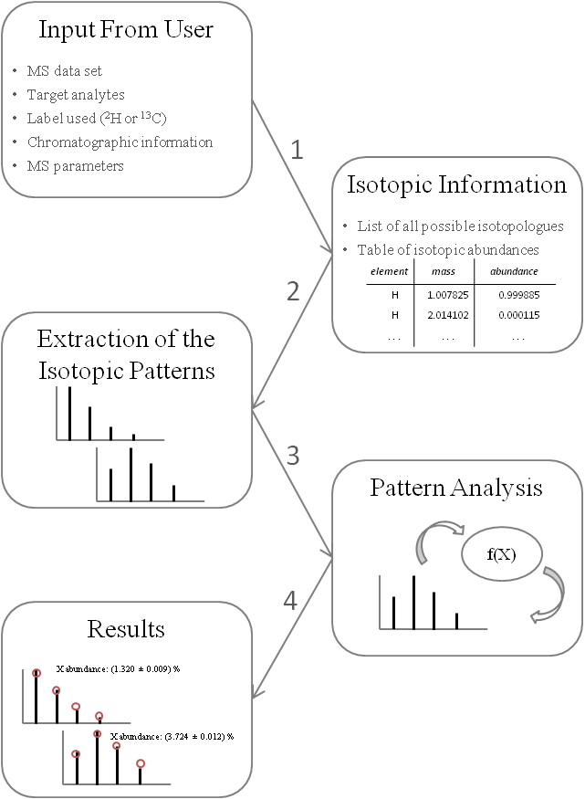

IsotopicLabelling R Package
======

# Installation

* Depends on
```
xcms, ecipex, stringr, gsubfn
```

* Install devtools
```
install.packages("devtools")
```

* Install 
```
library(devtools)
install_github("RuggeroFerrazza/IsotopicLabelling", build_vignettes = TRUE) 
```

# Block scheme

An exemplified block scheme of the package is the following:

  


# Further Information

For further details about *IsotopicLabelling*, please refer to the available vignette (see [here](vignettes/IsotopicLabelling-vignette.Rmd)), where a practical example is presented and discussed.
