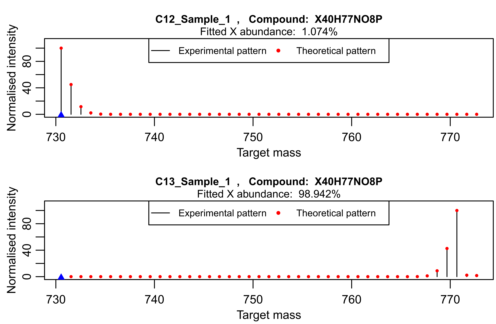
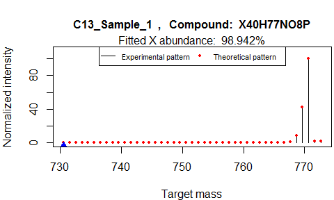
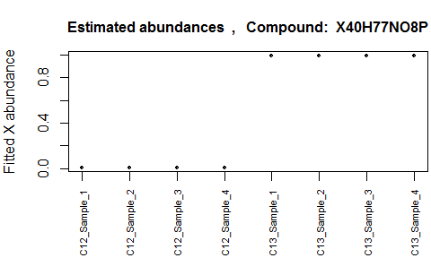

# Introduction

This document describes how to use the IsotopicLabeling R package to analyze MS data coming from isotopic labeling experiments. The main purpose of this package is to serve as a tool to determine the isotopic abundance of the isotope used in the labeling experiments (either ^2^H or ^13^C), in the metabolites of interest, which can be achieved by inspection of their isotopic patterns. In the following is a practical demonstration of how to use this package, together with a description of the main functions involved.

# Preparing the data

The IsotopicLabeling R package requires the input data to be an xcmsSet object, the result of LC-MS data pre-processing with the xcms package, the well-known framework for processing and visualization of chromatographically separated and single-spectra mass spectral data. An xcmsSet object basically contains the peak intensities or areas associated to each of the processed samples, together with their average retention time and *m/z*.

The xcmsSet object provided in the package, and easily accessible through the command
```
data("xcms_obj")
```
is an example of data set that may be obtained from labeling experiments: it contains LC-MS data relative to ^13^C labeling experiments on 8 samples: the first 4 represent the lipid extracts of cell coltures grown under normal conditions (natural ^13^C abundance), whereas in the last 4 samples the lipids were extracted from cells grown using with uniformly-labeled ^13^C glucose (99% ^13^C labeling). 

The first thing to do with the package is to convert the xcmsSet object into a data frame of experimental peak intensities or areas (one column for each sample), with the first two columns being the *m/z* and the retention times of the peaks. This data frame can be obtained with the table_xcms function:
```
peak_table <- table_xcms(xcms_obj)
```

which produces a data frame with as many columns as the number of samples, plus the first two columns reserved for *m/z* and the retention times. Below are the first rows of the table resulting from the example data.

```{r, results = "hide", echo = FALSE, message = FALSE, warning = FALSE}
library(IsotopicLabeling)
data("xcms_obj")
peak_table <- table_xcms(xcms_obj)
```
```{r, echo = FALSE}
head(peak_table)
```

Clearly, it is not compulsory to pre-process the LC-MS data with xcms, since such a data frame can be obtained in a number of other independent ways, such as by using proprietary software of the vendor of the MS instrument. The important thing is to provide to the IsotopicLabeling package a data frame formatted this way: 

- the first column, named "mz", should contain the mass-to-charge ratios of the peaks;
- the second column, named "rt", should contain the average retention times of the peaks (in seconds);
- the other columns should be named after the samples (one column for sample), and contain peak intensities or areas.

# Getting the results (quick way)

Once the table of peaks is available, a single function may be run to directly get the needed information:
```
fitted_abundances <- main_labeling(peak_table, compound, labeling, mass_shift, RT, RT_shift, 
chrom_width, initial_abundance)
```

The `main_labeling` function requires some input parameters:

- **peak_table**, the data frame of experimental peak intensities or areas;
- **compound**, a character vector specifying the chemical formula of the compound of interest. A special notation should be used, whereby the character "X" is used for denoting the element with unknown isotopic distribution (to be fitted by the package). For example, the [PC 34:1 + H]^+^ adduct, with chemical formula C42H83NO8P, should be written as "X42H83NO8P" for ^13^C isotopic labeling experiments, and "C42X82HNO8P" for ^2^H isotopic labeling experiments, in this last case keeping in mind that one hydrogen atom comes from the solvent, and has therefore fixed natural abundance.

    Please remember that adduct ions should be specified, and not the neutral molecular species;

- **labeling**, a character specifying the labeling element. It can be either "H" or "C";
- **mass_shift**, the maximum mass shift between measured and true mass. In other words, the mass accuracy of the measurements;
- **RT**, the expected retention time of the compound of interest (in sec);
- **RT_shift**, the maximum time shift allowed of the peaks with respect to the expected retention time (in sec);
- **chrom_width**, an estimate of the chromatographic width of the peaks (in sec);
- **initial_abundance**, either NA, or a numeric vector of the same length as the number of samples, with the initial guesses on the isotopic abundance of the labeling isotope. If provided, numbers between 0 and 1.

Using the data set of the example, the following parameters should be entered for the [PC 32:2 + H]^+^ adduct:
```
fitted_abundances <- main_labeling(peak_table, compound="X40H77NO8P", labeling="C", 
mass_shift=0.05, RT=285, RT_shift=20, chrom_width=7, initial_abundance=NA)
```


The steps undertaken by the `main_labeling` function are detailed in the following sections; the output of the analysis is an object of the class labeling, basically a list containing the results of the analysis. 
```{r, results = "hide", echo = FALSE, message = FALSE, warning = FALSE}
fitted_abundances <- main_labeling(peak_table, compound="X40H77NO8P", labeling="C", mass_shift=0.05, RT=285, RT_shift=20, chrom_width=7, initial_abundance=NA)
```
```{r}
attributes(fitted_abundances)
```

The details of the output can be found on the reference manual.

# Understanding the IsotoicLabeling package: a block scheme of the processing steps
 
The IsotopicLabeling package is based on the fact that the isotopic patterns obtained by MS reflect the isotopic abundances of the elements making up the observed compounds. Over the years, a number of different algorithms have been developed to a-priori compute isotopic patterns, knowing the relative distributions of the isotopes of any element. 

The problem with isotopic labeling experiments, though, is the opposite: a labeling isotope is used, and its relative abundance within the compounds of interest has to be inferred. The IsotopicLabeling package proposes to achieve this by exploiting the hidden information contained in the isotopic patterns. As explained above, an easy way to get this is by using the `main_labeling` function, which is basically a merging of successive functions each performing a particular job. In particular, the main steps are:

1. Gather information about the isotopes and all the possible isotopogues arising due to the labeling;
2. Extract the isotopic patterns of the compound of interest from the experimental data;
3. Analyze the obtained patterns in order to find the isotopic distribution of the labeling element that best describes the patterns.

Although the `main_labeling` function can perform all these steps at once, it is also possible to run separate functions for each of them. In the following, for the sake of explanation the second route is covered, an the steps are detailed.

## Isotopes and Isotopologues

The first function run by `main_labeling` is `isotopic_information`, which aims at gathering important information that will be required by the other functions of the package. It requires as input values the compound of interest, together with the type of labeling; in the example of [PC 32:2 + H]^+^, this would be:
```
info <- isotopic_information(compound="X40H77NO8P", labeling="C")
```
As detailed in the reference manual, the output is a named list:
```{r, results = "hide", echo = FALSE, message = FALSE, warning = FALSE}
info <- isotopic_information(compound="X40H77NO8P", labeling="C")
```
```{r}
attributes(info)
```
In particular, "isotopes" is a table with the natural isotopic abundances of the elements present in the compound, with the two isotopes of the labeling element X being given NA values:
```{r}
info$isotopes
```

Another important object is the "target" vector, which contains the exact masses of all the possible isotopologues of the species of interest coming from the labeling isotope. In the example, the [PC 32:2 + H]^+^ adduct has 40 carbon atoms, and therefore the possible isotopologues coming from ^13^C span a 41 mass range: from the monoisotopic species, where all the C atoms are ^12^C, to the species where all the 40 C atoms are ^13^C. However, since the isotopic patterns also depend on the other elements making up the compound, the list of target isotopologues is extended of two *m/z* units beyond the maximum achievable, which is enough for small and medium-sized molecules such as lipids and metabolites. 

The naming of the masses follows this convention:

- **M+0** is the monoisotopic species, where all the atoms (including X) are the lighest isotopes; 
- in **M+1** one light isotope (either X or any other element) is replaced by its heaviest counterpart;
- in **M+2** there have been two replacements, and so forth.

The underlying assumption is that the MS resolution is not high enough to resolve the isotopic fine structure, and therefore the replacement of, say, ^1^H with ^2^H is indistinguishable from the replacement of ^12^C with ^13^C. This is true for most of the instruments currently used in LC-MS measurements.

## Extracting the Experimental Isotopic Patterns

The next step is to extract the isotopic patterns from the experimental data. To this aim, the `isotopic_pattern` function can be used. In the example of [PC 32:2 + H]^+^, it is used this way:

```
experimental_patterns <- isotopic_pattern(peak_table, info, mass_shift=0.05, RT=285, 
RT_shift=20, chrom_width=7)
```
Among the input parameters are the table of peak intensities or areas, together with the list produced during the previous step. In addition, other parameters have to be specified, which have already been discussed previously, and are also detailed in the reference manual.

The net result is a matrix of the extracted patterns, with the first two columns reserved for the exact *m/z* and the retention times of the extracted peaks:
```{r, results = "hide", echo = FALSE, message = FALSE, warning = FALSE}
experimental_patterns <- isotopic_pattern(peak_table, info, mass_shift=0.05, RT=285, 
RT_shift=20, chrom_width=7)
```
```{r}
head(experimental_patterns, n=3)
```

In summary, what this function does is the following: 

1. It finds and stores the indices of the peaks that are within the specified *m/z* and RT ranges. This for all the target masses of the info$target vector;
2. It considers the retention times of the identified indices, and compares them across isotopologues in order to group them: peaks that differ in RT within the specified chromatographic width are assumed to come from two isotopologues of the same species;
3. At this point, more groups may be left: those having less than two identified isotopologues are discarded. If still more than one group is left, the one is chosen with the smallest difference between true and expected RT.

The figure below provides a graphical example of the patterns extracted for [PC 32:2 + H]^+^ in two samples, the first (to the left) without labeling, and the second one (to the right) with 99% ^13^C labeling. 


In this simple case, it can be seen at a glance that in the second case there is a great deal of labeling, since the most intense signal is shifted 40 mass units upwards with respect to the monoisotopic peak, therefore indicating that the most abundant species is the one where all the 40 carbon atoms have been replaced by its heaviest isotope (the labeling isotope, ^13^C). It is now the job of the IsotopicLabeling package to provide a quantitative estimate of the relative distribution between isotopes ^12^C and ^13^C in each sample.

## Analyzing the experimental patterns

Once the experimental patterns are available, they have to be analyzed in order to get an estimate of the isotopic abundance of the labeling isotope. This can be achieved through the function `find_abundance`. In the example,
```
fitted_abundances <- find_abundance(patterns=experimental_patterns, info, initial_abundance=NA)
```
There are three input parameters: the matrix of experimental patterns, the list "info" coming from the `isotopic_information` function, and the estimated initial abundances (default value= NA).

What the function does is to take each of the patterns, and fit the best theoretical pattern that reproduces it by iteratively changing the relative abundance between the isotopes of element X (either C or H, depending on the labeling experiment).

The output is an object of the class `labeling`, a list containing the results:
```{r, results = "hide", echo = FALSE, message = FALSE, warning = FALSE}
fitted_abundances <- find_abundance(patterns=experimental_patterns, info, initial_abundance=NA)
```
```{r}
attributes(fitted_abundances)
```
The details of each object can be found in the reference manual. Briefly, the estimated abundances of the labeling isotope are contained in `Best_estimate`, as numbers between 0 and 1. The standard errors coming from the fitting procedure (via the `nls` function) are in `std_error`, whereas `dev_percent` contains the percentage deviations of the best fitted theoretical patterns to the provided experimental patterns. The *m/z* values of the peaks in the patterns are in `x_scale`, whereas in `y_exp` are their normalized intensities, and in `y_theor` are the intensities of the fitted theoretical patterns. In addition, the residuals can be found in `residuals`.

What the function performs can be summarized as follows:

- Each experimental pattern is taken and normalized so that its highest signal is set to 100;
- The position of the most intense signal is assessed and used to get a first rough estimate of the isotopic abundance of X;
- A fitting procedure ensues through the `nls` function, whereby the single unkwown variable "isotopic  abundance of X" is iteratively changed starting from its estimated value, and each time the resulting (normalized) theoretical patterns are compared to the experimental pattern. The value obtained from the fitting procedure is the one that minimizes the the sum of squares of the difference between observed and theoretical values. 

    In order to take noise into account, a weight is given to the signals, proportional to the square root of their intensities. 
    
    The theoretical patterns are built by making use of the `ecipex` R package, which computes them by exploiting Fourier transforms of simplex-based elemental models.


# Looking at the results

Following the analysis, the results contained in the object of class *labeling* have to be looked at. To this aim, the IsotopicLabeling package provides several alternatives:

1. It is possible to quickly glance at the estimated abundances by using the generic function `summary`. In the example:

    ```{r}
    summary(fitted_abundances)
    ```

    A table is produced with in its first row the estimated values, and in the second one the standard deviations of the estimates from the fitting procedure. In the example, it can be seen that the estimates for the unlabeled samples have an average value of 1.08% (close to the natural value of 1.07%), whereas for the labeled samples the average is 98.94%.
    
2. A series of plots can be produced with the generic function `plot`, to get the normalized experimental patterns superimposed to the best fitted theoretical patterns:
    ```
    plot(fitted_abundances, what="patterns")
    ```
    Two of the produced plots are reported here:
    
    
    In addition, a further plot is created showing the estimated abundances with related standard errors:
    
    
    Notice that the plots are both shown to the screen and saved as *.png files; see the reference manual for further information. 